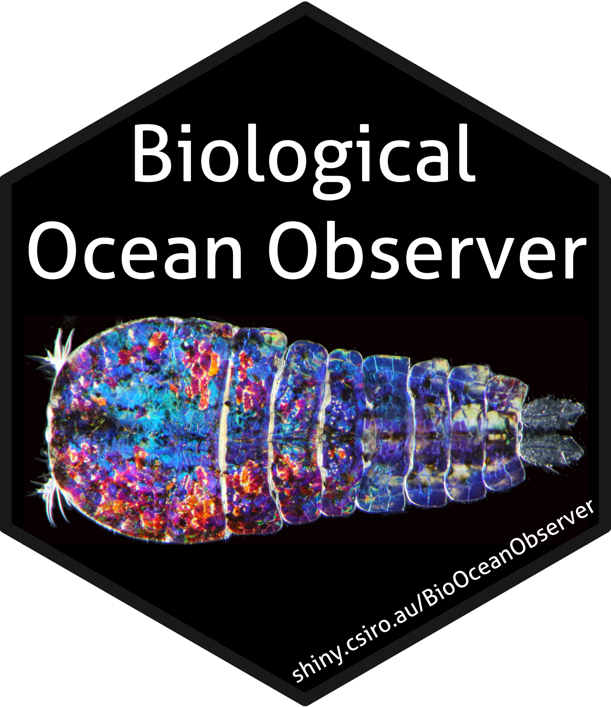

<!-- README.md is generated from README.Rmd. Please edit that file -->

```{r, include = FALSE}
knitr::opts_chunk$set(
  collapse = TRUE,
  comment = "#>",
  fig.path = "man/figures/README-",
  out.width = "100%"
)
```

# Biological Ocean Observer <a href='https://github.com/PlanktonTeam/IMOS_BioOceanObserver'></a>
<!-- badges: start -->
[](https://lifecycle.r-lib.org/articles/stages.html#experimental)
[](https://github.com/PlanktonTeam/IMOS_BioOceanObserver/actions/workflows/R-CMD-check.yaml)
[](https://github/PlanktonTeam/IMOS_BioOceanObserver/issues)
<!-- badges: end -->

The goal of the Biological Ocean Observer is to increase the availability of IMOS Biological data by allowing users to visualise, interact and download data products and code.

## Code of Conduct

Please note that the Biological Ocean Observer project is released with a 
[Contributor Code of Conduct](https://contributor-covenant.org/version/2/0/CODE_OF_CONDUCT.html). By contributing to this project, you agree to abide by its terms.

## Installation

If you wish to run the Biological Ocean Observer offline, are a power user, or would like to contribute to its development, you can install the development version from [GitHub](https://github.com/) using:

``` r
devtools::install_github("PlanktonTeam/IMOS_BioOceanObserver")
```

and run the application using:
``` r
library(imosboo)
run_app()
```

Please note however, that the above download and installation is not required if you simply want to use the Biological Ocean Observer. The latest version will always be available on the [Shiny Server](https://shiny.csiro.au/BioOceanObserver)
